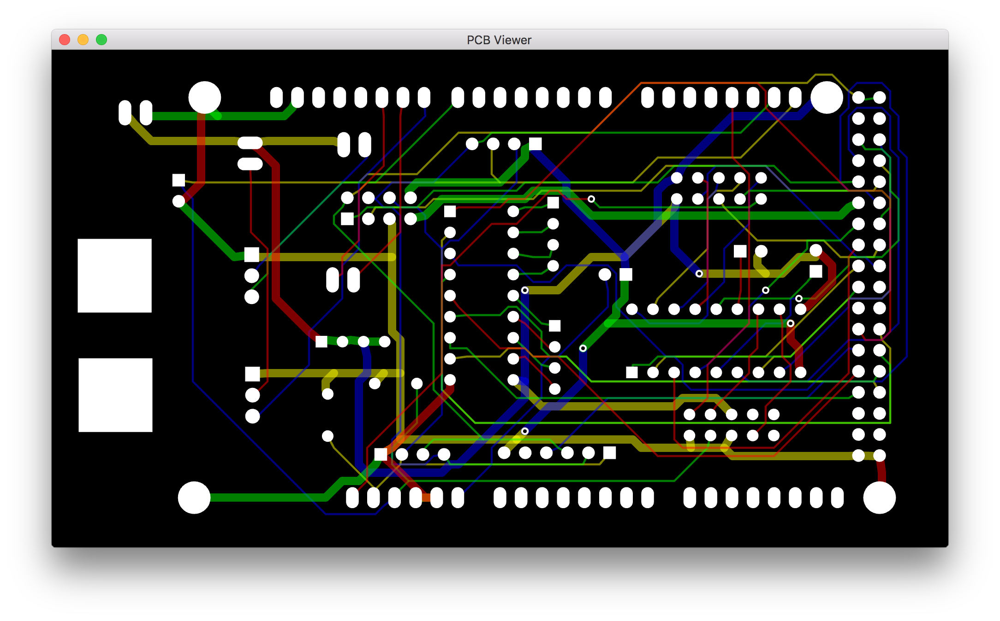
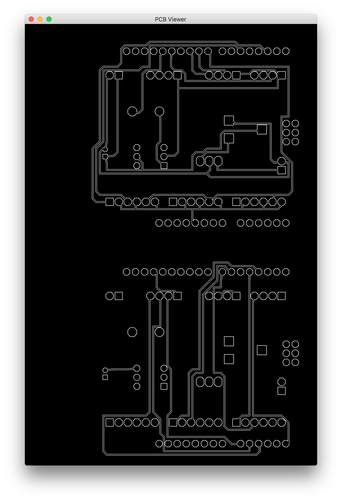

# C-PCB



## C++14 PCB router and solver.

Requires the glfw3 libs to be installed if you wish to build the viewer
application.

Build everything with:

```
make -j
```

Build just the parts you need with:

```
make -j [c_pcb c_pcb_dsn c_pcb_view]
```

Example command lines would be:

```
./c_pcb --v 1 netlist.pcb | ./c_pcb_view --o 1 --s 7
./c_pcb_dsn test1.dsn | ./c_pcb --v 1 --z 8 --q 10 --r 2 | ./c_pcb_view
```

You can drop the output to a file and view it as an animation with:

```
./c_pcb --v 1 netlist.pcb > anim
./c_pcb_view anim
```

`-h` or `--help` for help on either app.

Format of .pcb input file or stdin follows, stdout format is identical:

```
DIMS : (int width int height int depth)
POINT2D : (double:x double:y)
POINT3D : (double:x double:y double:z)
SHAPE : (POINT2D ...)
PATH : (POINT3D ...)
PATHS : ([PATH ...])
PAD : (double:pad_radius double:pad_gap POINT3D SHAPE)
PADS : ([PAD ...])
TRACK : (int id double:track_radius double:via_radius double:track_gap PADS PATHS)
PCB : DIMS TRACK ... ... ()
```

Special treatment is given to tracks with a track_radius of 0.0, they are used
to hold unused pads and keepout paths. No attempt is made to route them, they
are just added to the collision hash for all other routing. PADS can be empty
as well as PATHS.

Tracks containing paths as input to the router are treated as pre existing
wiring and are preserved as is in the output. Only pads of tracks with no
existing wiring to them are routed.

### DIMS : (int width int height int depth)

Dimensions of the board in units and layers.

eg.

```
(100 50 2)
```

### POINT2D : (double:x double:y)

2D point in units.

eg.

```
(56.7 24.3)
```

### POINT3D : (double:x double:y double:z)

3D point in units and layer. z layer is a double format but allways has a
fractional part of 0. layers are numbered from 0.

eg.

```
(56.7 24.3 0.0)
(50.7 25.3 1.0)
```

### SHAPE : (POINT2D ...)

2D shape specified in relative units. These shapes are used to represent pad
polygons, and are specified as closed polygons, the viewer fills these with a
fan fill. An empty shape is used to signify a circular pad with radius of
pad_radius. Two points are used to indicate an oval pad using the two points
and the pad_radius. 3 or more points are a polygon shape for the pad.

eg.

```
circle -> ()
oval -> ((-20.0 0.0) (20.0 0.0))
square -> ((-5.0 -5.0) (-5.0 5.0) (5.0 5.0) (5.0 -5.0) (-5.0 -5.0))
```

### PATH : (POINT3D ...)

A connected set of points on the PCB. Used to specify a section of a track or
keepout. Transitions between layers must only be vertical through the layers
and signify a via in that position.

eg.

```
((10.0 10.0 0.0) (20.0 5.0 0.0)
 (20.0 5.0 0.0) (20.0 5.0 1.0)
 (20.0 5.0 1.0) (30.0 10.0 1.0) (40.0 10.0 1.0) ...)
```

### PATHS : ([PATH ...])

A set of path sections electrically connected with each other, normally via the
pad terminals of components. Each track has a set of paths that are used to
create the collision hash for that track. Paths data present in the input
signify existing pre wiring for this track or keepout, and is retain unchanged
by the router while it fills in any remaining connections.

### PAD : (double:pad_radius double:pad_gap POINT3D SHAPE)

A single pad of a component. pads_radius is 0.0 if the pad shape is not a
circle or oval. pad_gap is the collision gap required by the pad in units. The
3D point is the position of the pad on the board and then the shape relative to
that position.

### PADS : ([PAD ...])

Represents all the electrically connected component pads of a track.

### TRACK : (int id double:track_radius double:via_radius double:track_gap PADS PATHS)

An set of electrically connected component pads and paths, or unused pads and
keepouts. track_radius in units for the size of all the tracks, via_radius for
the radius of all vias within this track and track_gap for the required gap
between the tracks and vias of this track any other components on the PCB.
track_radius of 0.0 specifies unused pads and or keepouts.

The id is just a user supplied track identifier that is unchanged from the
input to output, as the order of tracks in the output may be changed due to the
routing process. This allows the identification or sorting of the output by the
output consumer process etc.

## C_PCB options

```
-t:  timeout in seconds, default 600
-v:  verbosity level 0..1, default 0
-z:  vias cost, 0..100, default 0
-s:  number of samples, default 1
-r:  grid resolution 1..4, default 1
-q:  area quantization, default 1
-fr: flood range 1..5, default 2
-xr: even layer x range 0..5, default 1
-yr: odd layer y range 0..5, default 1
```

## More screenshots


