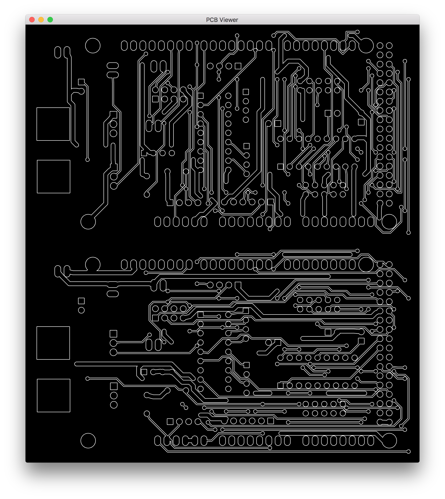

# C-PCB


## C++14 PCB router and solver.

Requires the glfw3 libs to be installed.

Build with:

```
make -j
```

Example command lines would be:

```
./pcb --v 1 netlist.pcb | ./view --o 1 --s 7
./dsn2pcb test1.dsn | ./pcb --v 1 --z 8 --q 10 --r 2 | ./view
```

You can drop the output to a file and view it as an animation with:

```
./pcb --v 1 netlist.pcb > anim
./view anim
```

`-h` or `--help` for help on either app.

Format of .pcb input file or stdin is:

```
[width, height, depth]
[track_radius, via_radius, track_gap, [(terminal_radius, terminal_gap, (x, y, z), [(x, y), ...]), ...]...]
```

You can stop a netlist early by just putting:

```
[]
```

For example:

```
[width, height, depth]
[track_radius, via_radius, track_gap, [(terminal_radius, terminal_gap, (x, y, z), [(x, y), ...]), ...]...]
[track_radius, via_radius, track_gap, [(terminal_radius, terminal_gap, (x, y, z), [(x, y), ...]), ...]...]
[]
[track_radius, via_radius, track_gap, [(terminal_radius, terminal_gap, (x, y, z), [(x, y), ...]), ...]...]
[track_radius, via_radius, track_gap, [(terminal_radius, terminal_gap, (x, y, z), [(x, y), ...]), ...]...]
```

Format of the viewer input is similar but has the track paths appended and the gaps removed:

```
[width, height, depth]
[track_radius, via_radius, track_gap, [(terminal_radius, terminal_gap, (x, y, z), [(x, y), ...]), ...]...], [(x, y, z), ...]]
```

## More screenshots


